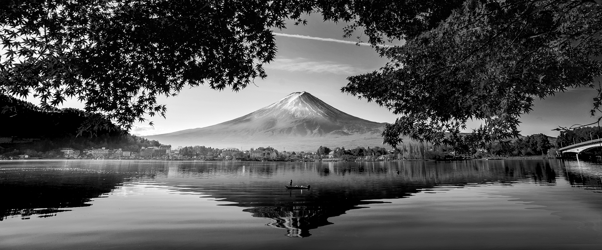

# Colorizer

A simple Conditional GAN implementation to colour black and white images using deep learning and [pytorch](https://pytorch.org). In the paper [Image-to-Image Translation with Conditional Adversarial Networks](https://arxiv.org/abs/1611.07004), many image to image translation tasks were proposed with colourising black and white images one of them. Some of the key concepts used in the paper were:

1. Using two loss functions:
   1. L1 Loss, to check how much the generated image is close to the original image, making it a supervised task.
   2. GAN loss, making it a unsupervised task.
2. U-Net as the generator, although I used the [DynamicUnet](https://docs.fast.ai/vision.models.unet.html) class of [fastai](https://docs.fast.ai) which helps to make a custom U-Net architecture out of an existing model architecture (here, resnet18).
3. A PatchDiscriminator as the discriminator.

# Training Process

1. As mentioned in the above paper, the colour images were split into three channels namely : L,' *a, and *b. The generator takes the 'L' channel of the image which is the grayscale channel and outputs two channels, concat them with L channel and then pass this new image to the discriminator.
2.  The DynamicUnet built using the resnet18 architecture was pretrained on 10k color images for 50 epochs
3. This pretrained Unet was then used as the generator against the discriminator during further training on this 10k images for 35 epochs.

# Results

The results shown here the outputs of the generator after the whole training process:

|  |                                                   

|  |                                                          

|  |                                                        

|  | 

|  |  

# Limitations

1. Due to limited resources and time, the network can be only trained on 10k images that too with size of 224x224 only.
2. The training process was also not very long (only 35 epochs for the whole GAN, and 50 epochs for pretraining the generator)

# Running

> make sure python == 3.6 or above is installed in your system
>
> download and unzip the repository
>
> open command line and change the directory to Colorizer
>
> pip install -r requirements.txt
>
> streamlit run streamlitApp.py

 

# Running With Docker

> make sure docker installed in your system
>
> download and unzip the repository
>
> open command line and change the directory to Colorizer
>
> build the image using:
>
> `docker build -t bwtocolor:api -f Dockerfile .`
>
> run the containerized app using:
>
> `docker run -p 8501:8501 bwtocolor:api`

